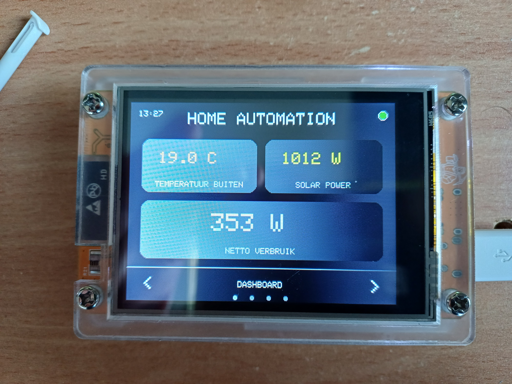
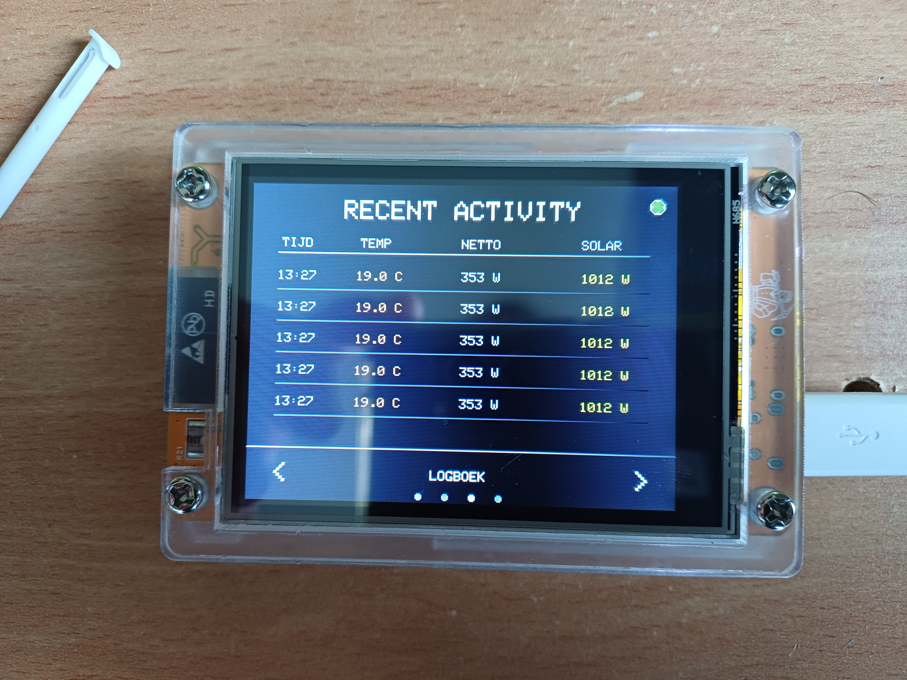
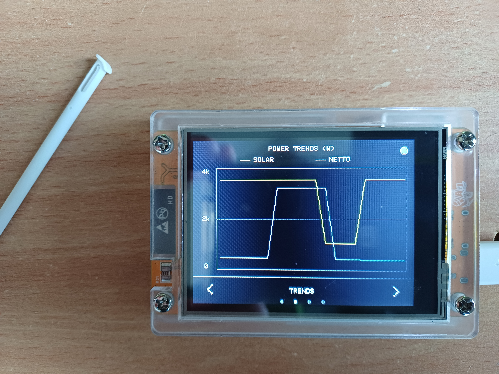
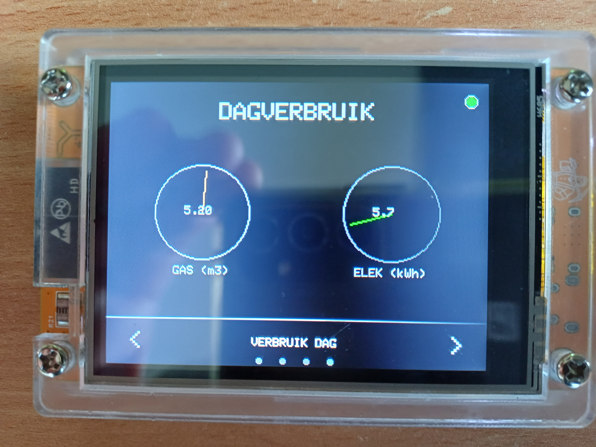

# 🏠 ESP32 CYD Smart Home Dashboard

A professional, multi-screen monitoring dashboard for the **ESP32-2432S028R** (Cheap Yellow Display). This project integrates with **Node-RED** via **MQTT** to display real-time energy, solar, and environmental data.






---

## 🚀 Features

- **4 Interactive Screens**:
  - **Dashboard**: Real-time Outdoor Temperature, Solar Power, and Net Consumption.
  - **Trends**: Dual-line graph showing Solar vs. Net Power history.
  - **Logbook**: Recent activity table with timestamps.
  - **Meters**: Visual gauges for daily Gas (m³) and Electricity (kWh) usage.
- **Smart Connectivity**:
  - Full **MQTT** integration for data and alarms.
  - **OTA (Over-The-Air)** updates with a visual progress bar on the display.
  - Connection status indicator (Green/Red LED on screen).
- **Hardware Optimizations**:
  - **LDR/MISO Fix**: Hybrid switching on Pin 39 to allow both Touch and Light Sensor usage.
  - **RGB LED Alarm**: Visual red alert when power consumption exceeds thresholds.
  - **Calibrated Touch**: Precise navigation using the XPT2046 controller.

---

## 🛠 Hardware Requirements

- **Board**: ESP32-2432S028R (2.8" ILI9341 TFT + XPT2046 Touch).
- **Sensors**: Built-in LDR (R21) and RGB LED.
- **Connectivity**: 2.4GHz WiFi.

---

## 📦 Libraries Used

- `TFT_eSPI` (Display driver)
- `XPT2046_Touchscreen` (Touch driver)
- `PubSubClient` (MQTT)
- `ArduinoJson` (JSON parsing)
- `ArduinoOTA` (Wireless updates)

---


## ⚙️ Setup & Configuration

### 1. WiFi & MQTT
Update the following constants in `src/main.cpp`:
```cpp
const char* ssid = "YOUR_WIFI_SSID";
const char* password = "YOUR_WIFI_PASSWORD";
const char* mqtt_server = "Your MQTT server";
2. Node-RED Integration
The ESP32 expects a JSON payload on the esp32/cyd/data topic:
code
JSON
{
  "temp": 12.5,
  "power": 1500,
  "solar": 2000,
  "dgas": 1.25,
  "delek": 8.4,
  "time": "14:30"
}
🔄 OTA Updates
To update the firmware wirelessly:
Ensure your computer is on the same network.
Select the network port CYD-Smart-Dashboard in your IDE.
Upload. The screen will show a blue progress bar during the process.
📝 License
This project is for personal home automation use. Feel free to modify and expand! I am gratefull to
the people who already published (Paul Stoffregen and others)info about this board, and helped me
overcome some issues concerning the hardware (pin 39 for LDR and Touch) in particular. 
