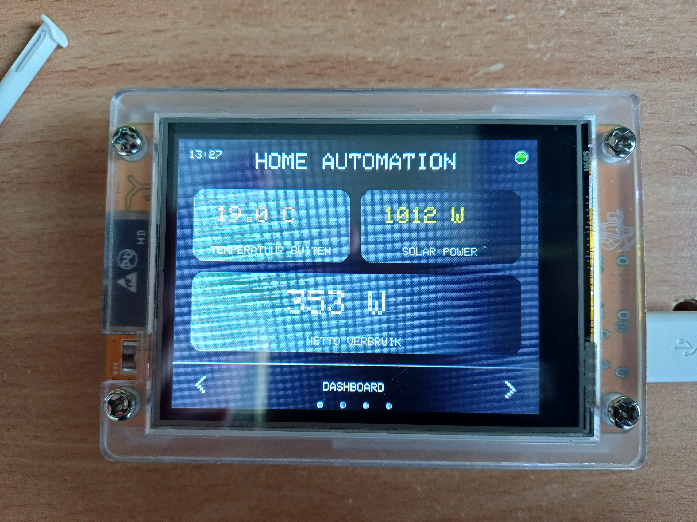
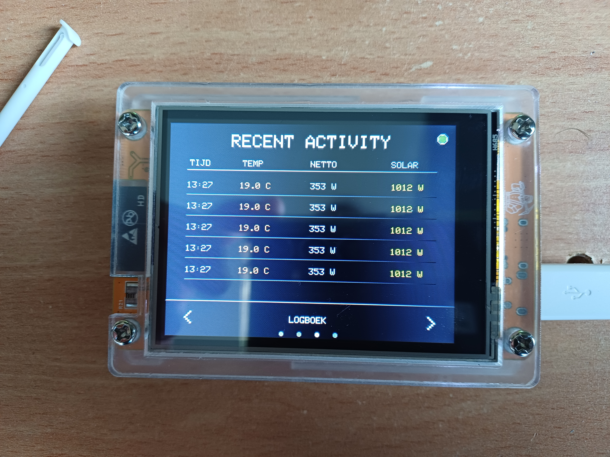
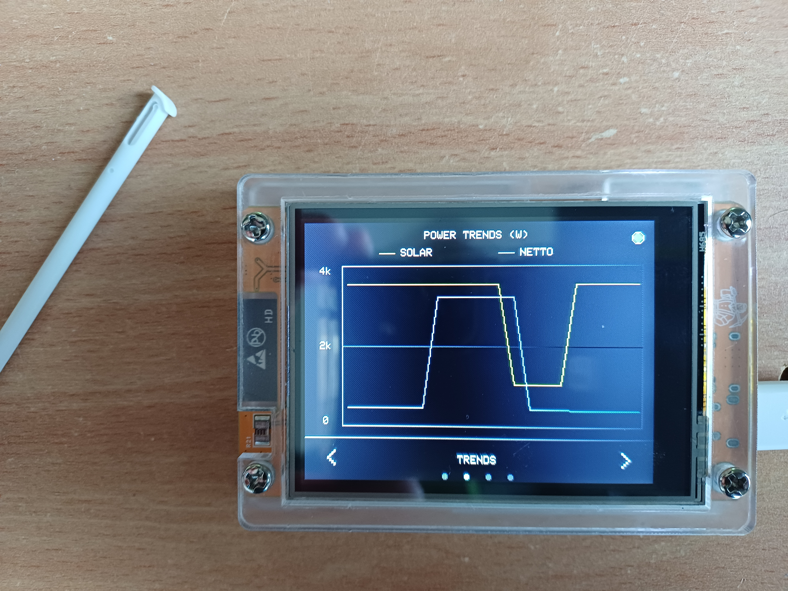
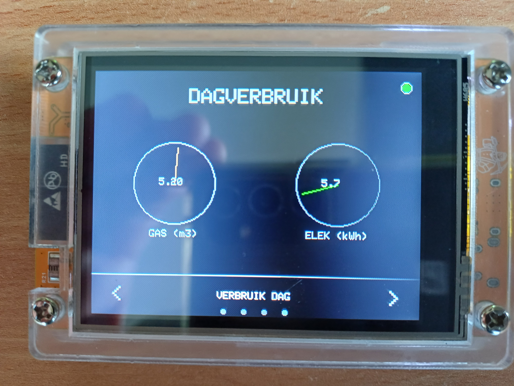

# 🏠 ESP32 CYD Smart Home Dashboard

A professional, multi-screen monitoring dashboard for the **ESP32-2432S028R** (Cheap Yellow Display). This project integrates with **Node-RED** via **MQTT** to display real-time energy, solar, and environmental data.






---

## 🚀 Features

- **4 Interactive Screens**:
  - **Dashboard**: Real-time Outdoor Temperature, Solar Power, and Net Consumption.
  - **Trends**: Dual-line graph showing Solar vs. Net Power history.
  - **Logbook**: Recent activity table with timestamps.
  - **Meters**: Visual gauges for daily Gas (m³) and Electricity (kWh) usage.
- **Smart Connectivity**:
  - Full **MQTT** integration for data and alarms.
  - USB uploads through `esptool` and OTA uploads through `espota`.
  - Exclusive **OTA display mode** with progress, success, and error feedback.
  - Connection status indicator (Green/Red LED on screen).
- **Hardware Optimizations**:
  - **LDR/MISO Fix**: IRQ-guarded hybrid switching on GPIO39, followed by explicit touch-SPI recovery.
  - Non-blocking periodic LDR measurements that remain mutually exclusive with touch handling.
  - **RGB LED Alarm**: Visual red alert when power consumption exceeds thresholds.
  - **Calibrated Touch**: Precise navigation using the XPT2046 controller.

---

## 🛠 Hardware Requirements

- **Board**: ESP32-2432S028R (2.8" ILI9341 TFT + XPT2046 Touch).
- **Sensors**: Built-in LDR (R21) and RGB LED.
- **Connectivity**: 2.4GHz WiFi.

---

## 📦 Libraries Used

- `TFT_eSPI` (Display driver)
- `XPT2046_Touchscreen` (Touch driver)
- `PubSubClient` (MQTT)
- `ArduinoJson` (JSON parsing)
- `ArduinoOTA` (Wireless updates)

---


## ⚙️ Setup and configuration

### WiFi and MQTT

Configure the credentials used by `main.cpp` in `include/secrets.h`:

```cpp
#define SECRET_SSID "YOUR_WIFI_SSID"
#define SECRET_PASS "YOUR_WIFI_PASSWORD"
#define SECRET_MQTT "YOUR_MQTT_SERVER"
```

### Node-RED integration

The dashboard expects a JSON payload on the `esp32/cyd/data` topic:

```json
{
  "temp": 12.5,
  "power": 1500,
  "solar": 2000,
  "dgas": 1.25,
  "delek": 8.4,
  "time": "14:30"
}
```

Alarm commands use the existing `esp32/cyd/alarm` topic.

## 🔌 Upload environments

- `cyd`: USB upload using `esptool`.
- `cyd_ota`: network upload using `espota` to the configured `upload_port`.

Build either environment without uploading:

```bash
pio run -e cyd
pio run -e cyd_ota
```

Upload over USB:

```bash
pio run -e cyd -t upload
```

Upload over WiFi:

```bash
pio run -e cyd_ota -t upload
```

During a real OTA upload the TFT shows `OTA UPDATE`, a progress bar and percentage. MQTT screen
updates, touch navigation, and LDR measurements are temporarily suspended. At completion it shows
`Upload voltooid`; OTA errors display their error code before the normal screen is restored.

## 📝 License

This project is for personal home automation use. Feel free to modify and expand it. Thanks to Paul
Stoffregen and others whose published information about the CYD hardware helped resolve the shared
GPIO39 LDR/touch-MISO behavior.
